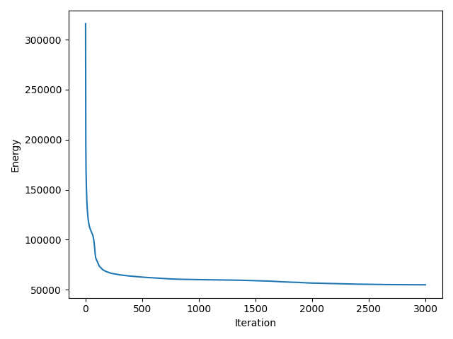
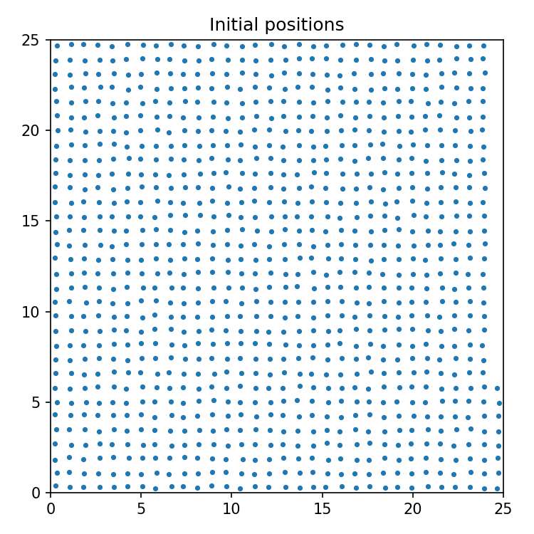
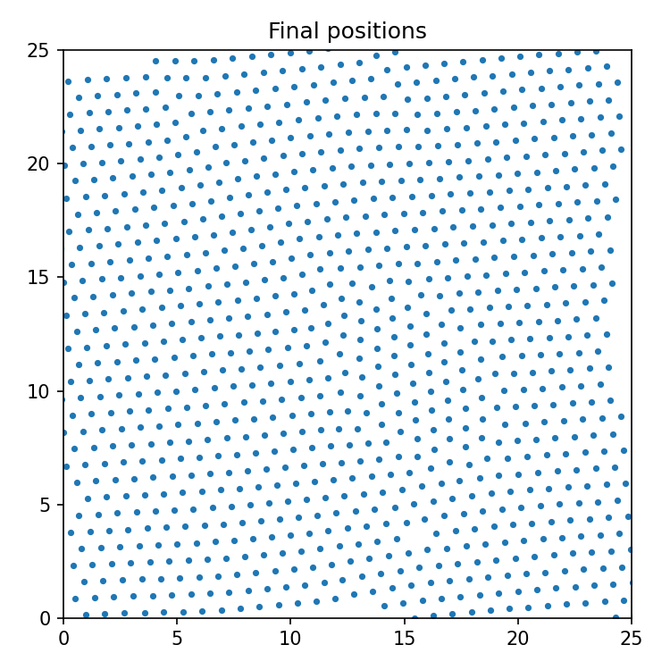
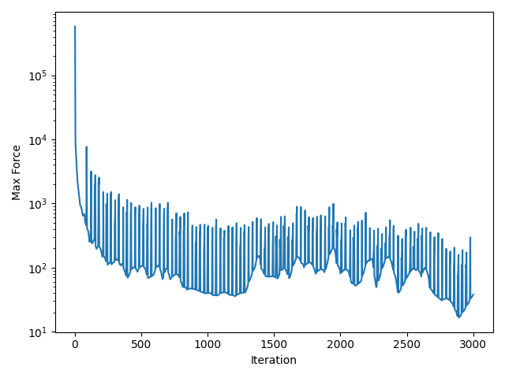
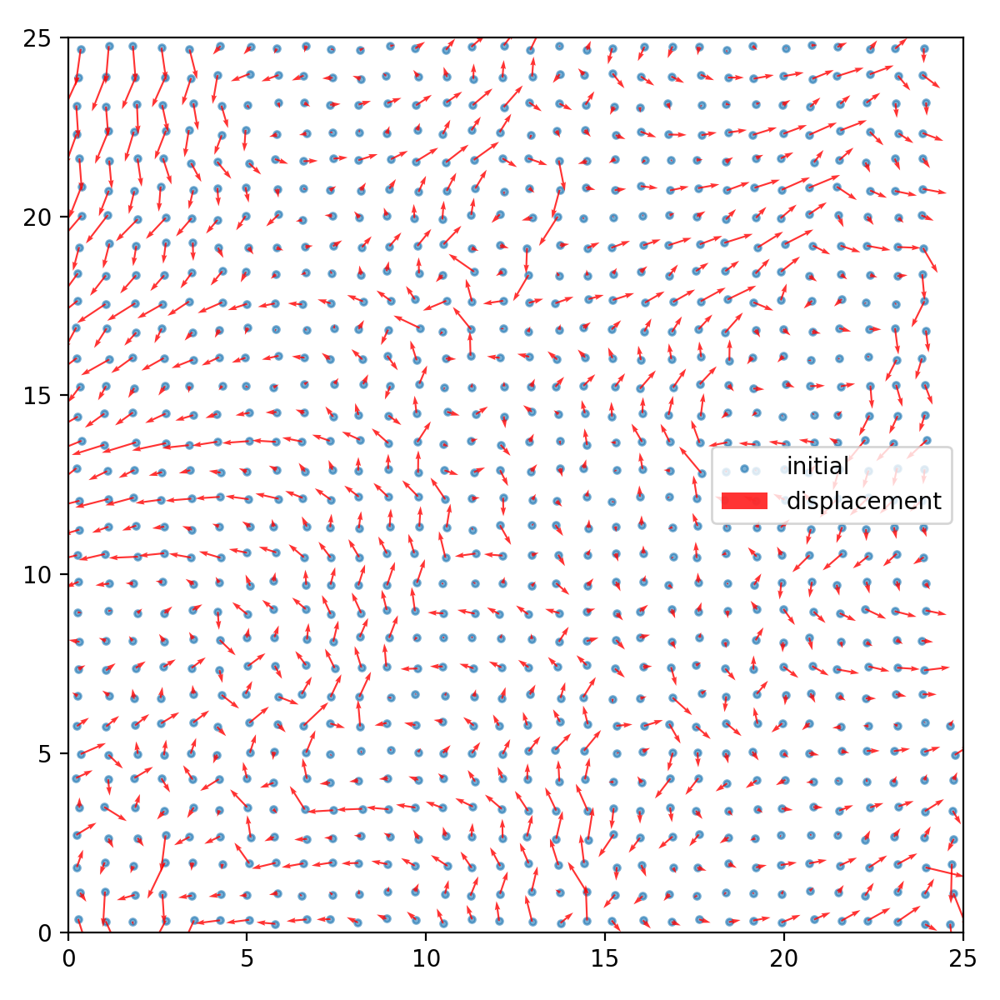

# Glassy State Simulation using Lennard-Jones Potential

A Python-based simulation of a two-dimensional particle system using the **Lennard-Jones Potential** and the **Steepest Descent Optimization Algorithm** to obtain a stable low-energy glassy-state configuration.

# Overview

This project simulates the structural relaxation of a two-dimensional system of interacting particles. Starting from an initial particle arrangement, the simulation computes inter-particle forces using the Lennard-Jones potential and iteratively updates particle positions using the Steepest Descent algorithm. The objective is to minimize the total potential energy and obtain a stable glassy-state configuration.

This project was developed as part of the **Semester 1 Mathematics Project** for the B.Tech Artificial Intelligence & Data Science program at **Amrita Vishwa Vidyapeetham**.

# Features

- Two-dimensional particle simulation
- Lennard-Jones interaction model
- Steepest Descent optimization
- Potential energy minimization
- Force convergence analysis
- Particle displacement visualization
- Scientific data visualization using Matplotlib
  
# Mathematical Model

# Lennard-Jones Potential

The interaction between two particles is described by:

```
U(r) = 4ε[(σ/r)^12 − (σ/r)^6]
```

where

- **U(r)** = Potential energy
- **r** = Distance between particles
- **ε (epsilon)** = Depth of the potential well
- **σ (sigma)** = Distance where the potential becomes zero

The potential combines short-range repulsion and long-range attraction, allowing the particles to naturally settle into a stable configuration.

# Steepest Descent Update

Particle positions are updated using

```
r(k+1) = r(k) + αF(r)
```

where

- **r(k)** = Current particle position
- **F(r)** = Force acting on the particle
- **α (alpha)** = Step size

The optimization continues until the system converges to a low-energy state.

# Workflow

1. Initialize particle positions.
2. Compute Lennard-Jones forces.
3. Calculate total potential energy.
4. Update particle positions using Steepest Descent.
5. Repeat until convergence.
6. Save the optimized particle configuration.
7. Generate plots and analysis.

# Results

# Energy Convergence

The total potential energy decreases rapidly during the initial iterations before gradually converging to a stable minimum.



# Initial Particle Configuration

Initial arrangement of particles before optimization.



# Final Particle Configuration

Optimized particle positions after energy minimization.



# Maximum Force Convergence

Variation of the maximum force acting on particles during optimization.



# Particle Displacement

Displacement vectors showing particle movement from the initial configuration.



# Simulation Parameters

| Parameter | Value |
|-----------|------:|
| Number of Particles | 1024 |
| Dimensions | 2D |
| Potential Model | Lennard-Jones |
| Optimization Algorithm | Steepest Descent |
| Maximum Iterations | 3000 |
| Step Size | 0.02 |
| ε (epsilon) | 1.0 |
| σ (sigma) | 1.0 |

# Technologies Used

- Python
- NumPy
- Matplotlib

# Repository Structure

```text
Glassy-State-Simulation/
│
├── Main.py
├── README.md
├── Report.pdf
└── results/
    ├── energy.png
    ├── initial.png
    ├── final.png
    ├── maxforce.png
    └── overlay.png
```

# References

1. J. E. Lennard-Jones, *On the Determination of Molecular Fields*, 1924.
2. D. Frenkel and B. Smit, *Understanding Molecular Simulation*.
3. M. P. Allen and D. J. Tildesley, *Computer Simulation of Liquids*.

# Author

**Revanth S**

B.Tech Artificial Intelligence & Data Science

Amrita Vishwa Vidyapeetham

If you found this project useful, consider giving it a ⭐.
